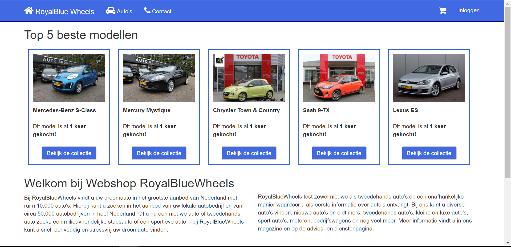
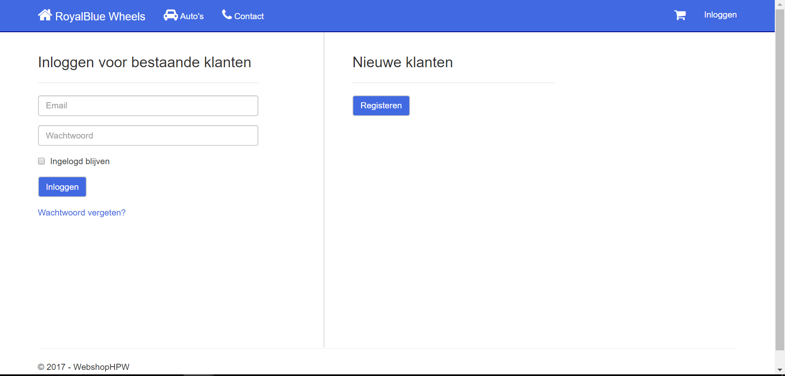
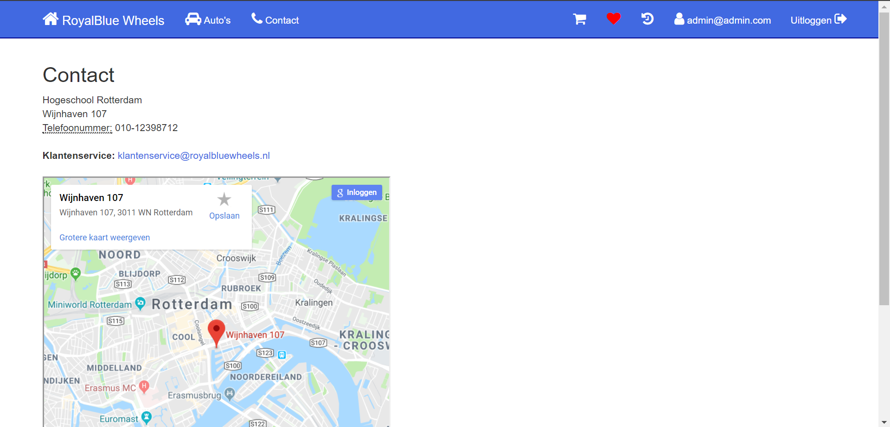
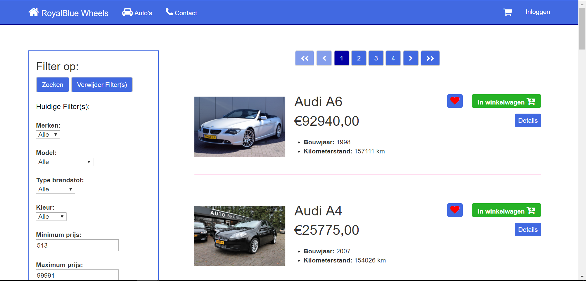
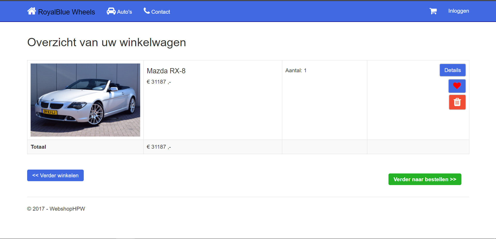
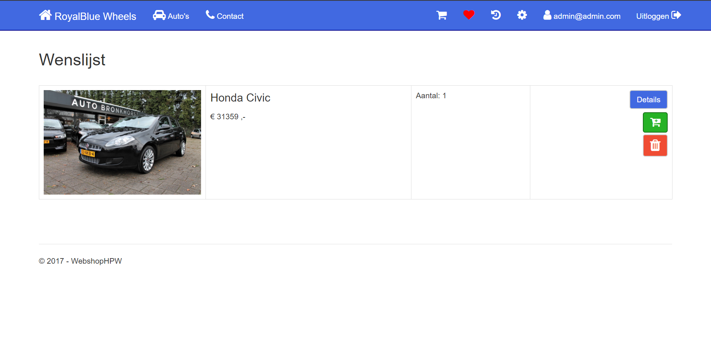
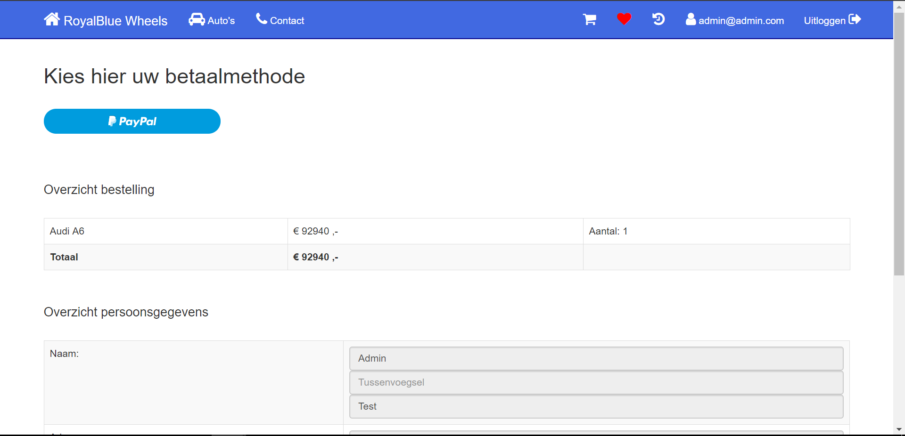
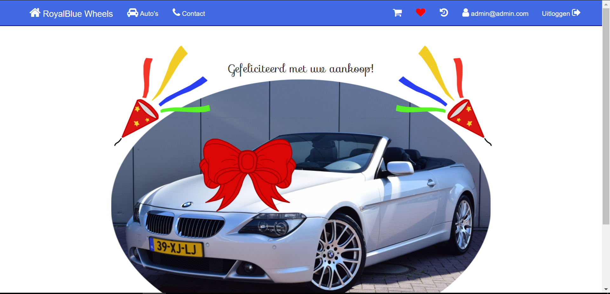
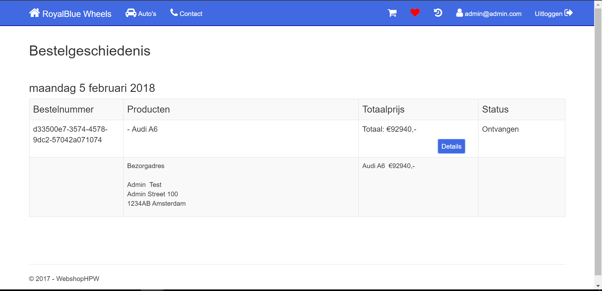
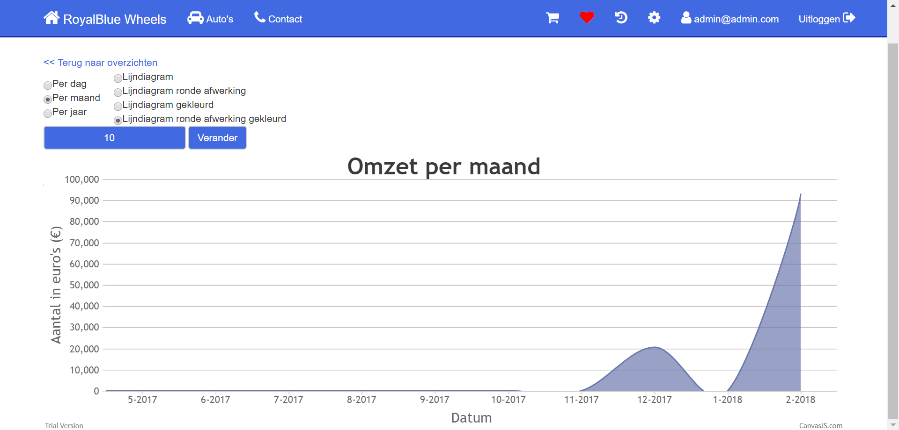

## RoyalBlueWheels

A webshop for selling used vehicles.

## Screenshots

<table>
    <tr>
        <td>
            
          The initial landing page when accessing the website.
       </td>   
</table>
<table>
    <tr>
        <td>
            
          A page containing the register and login functionality. SendGrid is used to allow users to confirm their email and provides a           functionality to reset passwords.
        </td>
        <td>
            
          A page containing all contact information.
        </td>
    </tr>
</table>
<table>
    <tr>
        <td>
            
          A page with all listed cars along with a filter functionality.
        </td>
    </tr>
</table>
<table>
    <tr>
        <td>
            
          A page containing all items currently in the shopping cart.
        </td>
        <td>
            
          A page containing all items on the user's wishlist.
        </td>
    </tr>
</table>
<table>
    <tr>
        <td>
            
          A page for the user to finalise the payment. The site uses a PayPal sandbox to simulate real payments.
        </td>
        <td>
            
          A page after the user has successfully paid.
        </td>
    </tr>
</table>
<table>
    <tr>
        <td>
            
         A page with the order history of the user.
        </td>
  </tr>
</table>
<table>
    <tr>
        <td>
            
         A page for an admin to check statistics of sales.
        </td>
  </tr>
</table>

## Details

The website was designed based on the MVC design pattern, using C#, a Razor template and Javascript. The webshop is supported by a Postgres database. Sensitive user information such as passwords is hashed. The webshop uses SendGrid to send emails. A PayPal sandbox is in place to simulate real payments. 

## Usage

The application requires a Postgres SQL database.
